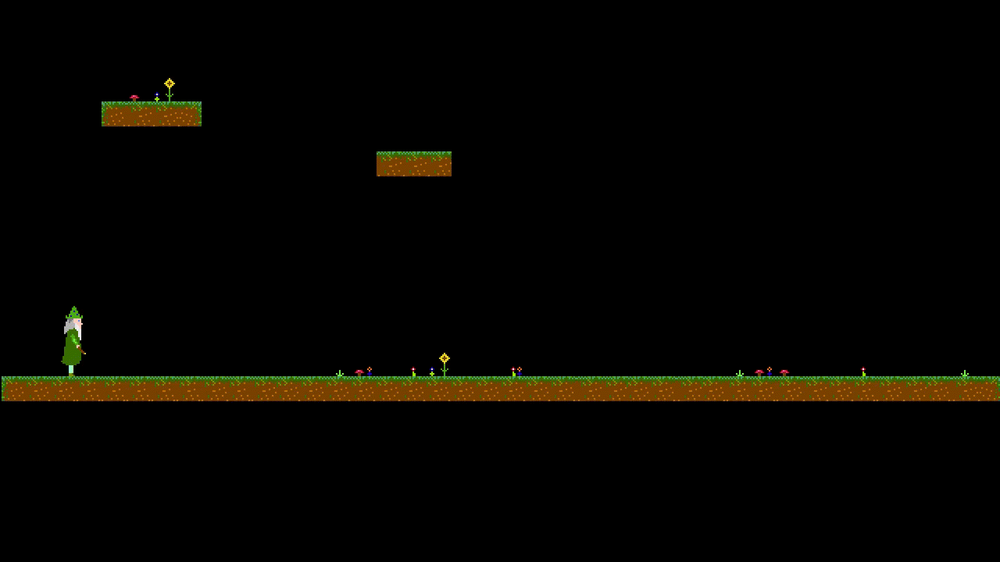

# Wizard Fun Run



This is my (Jørns) sandbox for experimenting with C++.

More specifically game programming in C++. This is supposed to become some sort
of a playable 2D-platformer one day. (hopes and dreams) I'm using SFML for I/O, which is pretty low-level. (and awesome!)
But the core game engine (physics, animations, state transitions etc.) is written by myself.

Also note that this is an eclectic mix of best practices in C++ and some wild experiments
that I do to satisfy my curiosity. This is not written by a game programmer, and is not supposed
 to be instructional. Any sane person
who wants to make actual games as a hobby (rather than for learning purposes) should probably
use a proper game engine. (I suggest Godot: https://godotengine.org/ because it's free and open-source)

# Tooling
Using aseprite (https://www.aseprite.org/) for creating sprites and exporting sprite metadata
in json format, which in turn the game engine uses for importing sprite sheets.

# Build dependencies
CMake (version >= 3.12) is used for building.
Currently I have only tested compiling with G++-9.3 on Linux. I suspect that this will compile on most
platforms, as long as the compiler is C++17 compliant.

## Conan
Conan is used for managing dependencies. So it must be installed in order 
for the dependencies to be installed. Conan can be installed with python-pip.
Like this:
```
pip3 install conan
```
Also you need to make sure that conan is in your PATH, so that cmake can find it.
